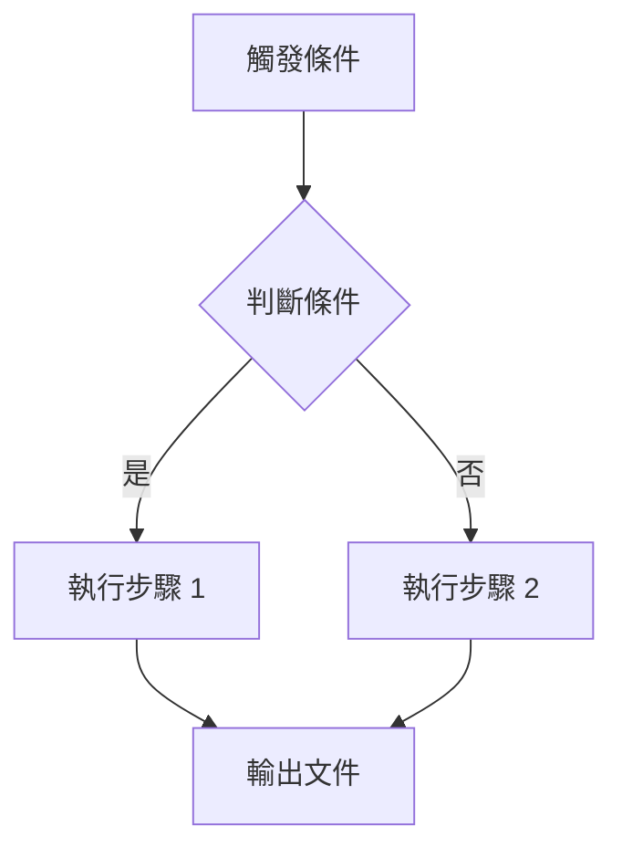

# PRO 類型規範 / PRO Type Specification

PRO（Procedure）為具體說明「如何執行」的程序書，是政策（POL）的實施層文件。PRO 定義完整的操作流程、RACI 責任矩陣、SLA 時限，並以 Mermaid 流程圖呈現執行邏輯。

## 必要章節結構

1. 【必要】目的與範圍 — 說明程序書的執行目的、適用單位、觸發條件及不適用情境
2. 【必要】相關文件 — 列出上層政策（parent_policy）、引用的 STD/GDL，以及此程序產出的 FRM/REG
3. 【必要】角色與責任（RACI） — 以 RACI 矩陣列出所有角色（R=負責、A=當責、C=諮詢、I=告知）及對應活動
4. 【必要】程序步驟 — 含 Mermaid 流程圖及逐步說明，每步指定執行角色、輸入/輸出文件
5. 【必要】監控與量測 — 說明 KPI 指標及 SLA 時限（含具體數字，如「72 小時內完成」）
6. 【必要】紀錄與保存 — 列出此程序產生的所有紀錄、保存年限及儲存位置
7. 【必要】附錄 — 補充說明、決策樹、參考圖表或 FRM 表單範本

## 語氣與用詞規範

- 程序步驟使用動詞起首的祈使句（「收集」、「驗證」、「提交」、「核准」）
- 角色名稱使用職稱而非個人姓名（「ESG 主管」而非「王大明」）
- SLA 時限使用具體數字（「5 個工作日」而非「儘快」）
- RACI 矩陣中每個活動只能有一個 A（當責者）
- 不在 PRO 中重述 POL 的政策聲明；只說明操作細節

## 必要元素

- 【必要】parent_policy 引用：相關文件章節中必須明確列出 `parent_policy: POL-XXX`，指向上層政策
- 【必要】RACI 矩陣：以 Markdown 表格呈現，行為活動、列為角色，儲存格填入 R/A/C/I
- 【必要】SLA 數字（含時限）：監控與量測章節至少一個量化的時限指標
- 【必要】Mermaid 流程圖：程序步驟章節必須包含至少一個 Mermaid flowchart，反映主要執行路徑
- 【必要】產出文件列表：紀錄與保存章節列出此程序輸出的 FRM 和 REG 文件識別碼

## Mermaid 流程圖規範

- 使用 `flowchart TD`（由上而下）或 `flowchart LR`（由左至右）
- 節點形狀：矩形 `[]` 為一般步驟，菱形 `{}` 為決策點，圓角 `()` 為開始/結束
- 不使用 ASCII 圖；禁止 oklch() 色彩
- 流程圖節點標籤使用中文

## 交叉引用規則

- 相關文件中必須引用 parent_policy（格式：`POL-XXX`）
- 使用的表單須引用 FRM 文件識別碼；程序產生的紀錄須引用 REG 文件識別碼
- 引用外部標準方法時，使用 STD 文件識別碼
- 涉及計算方法時，引用 GDL 文件識別碼
- 若有跨部門協作，引用相關 PRO 文件說明介面

## 審查重點

- PR1 **parent_policy**：相關文件章節是否明確列出 parent_policy；對應的 POL 文件是否存在
- PR2 **RACI**：RACI 矩陣是否覆蓋所有程序步驟；每個活動是否只有一個 A
- PR3 **SLA 數字**：監控與量測章節是否有具體時限數字；SLA 是否可量測
- PR4 **流程圖**：Mermaid 語法是否正確（可渲染）；流程圖是否反映程序的主要執行路徑
- PR5 **紀錄完整性**：是否列出所有產出文件；保存年限是否符合法規要求

## 類型特定關鍵字

`RACI`、`parent_policy`、`SLA`、`流程圖`、`觸發條件`、`程序步驟`、`監控`
