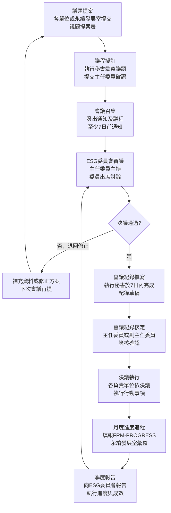

# ESG 委員會運作程序書

**制定單位：** 永續發展室
**版本：** 1.0
**生效日期：** 2026-05-05
**上位政策：** POL-ESG ESG 永續發展政策

---

## 1. 目的與範圍

### 1.1 目的

本程序書旨在規範國軍高雄總醫院 ESG 委員會之組成、職掌、運作方式及決議執行追蹤機制，確保 ESG 治理架構有效運作，各項永續發展決策得以透明、有效率地推動與落實。

### 1.2 適用範圍

本程序適用於 ESG 委員會之所有定期會議、臨時會議及相關決議執行追蹤作業。

### 1.3 上位政策

本程序書依據 POL-ESG ESG 永續發展政策制定，並與之一致。

---

## 2. 相關文件

| 文件類型 | 文件編號 | 文件名稱 |
|---------|---------|---------|
| 政策文件 | POL-ESG | ESG 永續發展政策 |
| 矩陣 | MTX-STAKEHOLDER | 利害關係人鑑別矩陣 |
| 矩陣 | MTX-RISK-CLIMATE | 氣候風險評估矩陣 |
| 計畫 | PLN-ANNUAL | 年度 ESG 工作計畫 |
| 矩陣 | MTX-TIMELINE | 關鍵時程總表 |
| 表單 | FRM-PROGRESS | ESG 月度進度回報表 |

---

## 3. 角色與責任（RACI）

### 3.1 委員會組成

ESG 委員會依下列職位組成，以確保各業務面向均有代表參與決策：

| 職稱 | 擔任人員 | 職責 |
|------|---------|------|
| **主任委員** | 院長 | 最高決策核准、代表管理階層承諾 |
| **副主任委員** | 副院長 | 協助主任委員推動；主任委員不克出席時代理主持 |
| **委員** | 永續發展室主任 | 統籌 ESG 議題彙整與執行協調 |
| **委員** | 醫勤組長 | 代表廚務/廢棄物等醫勤業務 |
| **委員** | 工程室主任 | 代表設施、能源、建案業務 |
| **委員** | 環安衛室主任 | 代表環境安全衛生業務 |
| **委員** | 醫教部主任 | 代表醫療品質與評鑑業務 |
| **委員** | 社工室主任 | 代表社會參與與社區服務業務 |
| **執行秘書** | 永續發展室（指派承辦人） | 會議籌辦、紀錄撰寫、決議追蹤 |

### 3.2 RACI 矩陣

| 活動項目 | 主任委員 | 副主任委員 | 永續發展室 | 各單位委員 | 執行秘書 |
|---------|---------|---------|---------|---------|---------|
| 議題提案蒐集 | I | I | R | C | R |
| 會議召集與通知 | A | I | I | I | R |
| 議程擬訂 | A | C | R | C | R |
| 會議主持 | R | C | I | I | I |
| 會議紀錄撰寫 | I | I | C | I | R |
| 會議紀錄核定 | A | C | R | I | I |
| 決議事項執行 | A | I | R/C | R | I |
| 執行進度追蹤 | I | I | R | C | R |
| 年度績效報告 | A | C | R | C | I |
| 外部資訊揭露核准 | A | C | R | I | I |

**RACI說明：**
- **R** = Responsible（執行負責）
- **A** = Accountable（當責核准）
- **C** = Consulted（諮詢提供意見）
- **I** = Informed（知會告知）

---

## 4. 程序步驟

### 4.1 作業流程圖

### 4.2 定期會議（季度）

ESG 委員會**應**每季召開定期會議，時程建議如下：

| 季度 | 建議召開時間 | 主要議題 |
|------|-----------|---------|
| Q1（一季） | 每年3月底前 | 審查上年度 ESG 績效；核定本年度工作計畫 |
| Q2（二季） | 每年6月底前 | 審查上半年執行進度；檢視氣候風險 |
| Q3（三季） | 每年9月底前 | 審查前三季進度；更新利害關係人鑑別結果 |
| Q4（四季） | 每年12月底前 | 審查全年預期成果；確認次年工作計畫方向 |

### 4.3 臨時會議

發生下列情況時，主任委員**應**授權執行秘書召開臨時會議：

- 發生重大環安衛事故
- 相關法規有重大變更，須即時因應
- 主管機關稽查或要求有重大改善事項
- ESG 重大指標嚴重偏離目標

### 4.4 出席要求

- 委員出席率**應**達 2/3 以上，方可召開並作成決議
- 無法出席者**應**事先以書面委託其他委員代理，並提交書面意見
- 會議決議以出席委員過半數同意通過

### 4.5 決議執行追蹤

每次會議決議事項，執行秘書**應**建立追蹤清冊，記錄：決議編號、負責單位、預定完成日、實際完成日、狀態。追蹤結果每月於 FRM-PROGRESS 中更新，每季提報委員會。

---

## 5. 監控與量測（SLA）

| 服務水準項目 | 標準 |
|------------|------|
| 定期會議召集通知 | 會議日前至少 7 個工作日 |
| 會議紀錄撰寫完成 | 會議後 7 個工作日內 |
| 會議紀錄核定發送 | 撰寫完成後 3 個工作日內 |
| 決議事項月度追蹤 | 每月最後一個工作日前更新 |
| 年度 ESG 績效報告 | 次年 4 月 30 日前發行 |

---

## 6. 紀錄與保存

| 紀錄類型 | 保存格式 | 保存期限 | 保管單位 |
|---------|---------|---------|---------|
| 會議通知及議程 | 電子檔 | 5年 | 永續發展室 |
| 會議紀錄（含決議清單） | 電子檔及紙本 | 5年 | 永續發展室 |
| 決議追蹤清冊 | 電子檔 | 5年 | 永續發展室 |
| 委員出席紀錄 | 電子檔 | 5年 | 永續發展室 |
| 年度 ESG 績效報告 | PDF | 10年 | 永續發展室 |

---

## 7. 附錄

### 附錄A：委員會運作重點時程

| 月份 | 事項 |
|------|------|
| 1月 | 彙整上年度 ESG 績效數據 |
| 2月 | 準備年度績效報告草稿 |
| 3月 | Q1 委員會：審查年度績效、核定工作計畫 |
| 4月 | 發行年度 ESG 報告 |
| 6月 | Q2 委員會：審查上半年進度 |
| 8月 | 更新利害關係人鑑別矩陣 |
| 9月 | Q3 委員會：審查前三季進度 |
| 11月 | 規劃次年工作計畫 |
| 12月 | Q4 委員會：確認次年方向 |

### 附錄B：程序書版次歷史

| 版次 | 修訂日期 | 修訂內容 | 修訂人 |
|------|---------|---------|------|
| 1.0 | 2026-05-05 | 初版建立 | 永續發展室 |
