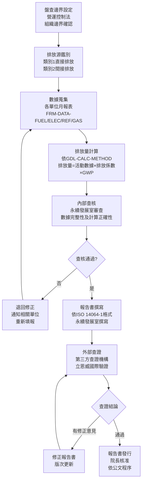

# 溫室氣體盤查作業程序書

## 1. 目的與範圍

### 1.1 目的

本程序書旨在規範國軍高雄總醫院年度溫室氣體盤查作業，確保盤查過程符合 ISO 14064-1:2018（CNS 14064-1:2021）標準要求，建立一致性、可比較性且可稽核的溫室氣體排放清冊，作為減碳規劃及外部查證之依據。

### 1.2 適用範圍

本程序適用於國軍高雄總醫院總院院區（高雄市苓雅區中正一路2號）之年度溫室氣體盤查作業，涵蓋：

- **組織邊界**：採營運控制法，納入本院管理維護之建築、設施與公共空間
- **盤查類別**：類別1（直接溫室氣體排放）與類別2（外購電力間接排放）
- **排除範圍**：外部單位租用電量、鳳翔營區及721營站
- **盤查週期**：每年1月1日至12月31日

### 1.3 參考標準

- ISO 14064-1:2018 / CNS 14064-1:2021 溫室氣體盤查規範
- ISO 14064-3:2019 溫室氣體查證規範
- 環境部公告溫室氣體排放係數（113年2月5日公告）
- IPCC AR6（2021）第六次評估報告全球暖化潛勢值

---

## 2. 相關文件

| 文件類型 | 文件編號 | 文件名稱 |
|---------|---------|---------|
| 政策文件 | POL-ESG | 永續發展政策 |
| 報告書 | RPT-GHG-2025 | 2025年溫室氣體盤查報告書 |
| 指引 | GDL-CALC-METHOD | 溫室氣體排放量計算方法指引 |
| 表單 | FRM-DATA-FUEL | 油料活動數據月報表 |
| 表單 | FRM-DATA-ELEC | 電力活動數據月報表 |
| 表單 | FRM-DATA-REF | 冷媒填充紀錄表 |
| 表單 | FRM-DATA-GAS | 氣體鋼瓶及滅火器紀錄表 |
| 清冊 | MTX-EMISSION | 溫室氣體排放源清冊 |

---

## 3. 角色與責任（RACI）

### 3.1 組織架構

本院溫室氣體盤查推動組織架構設院長擔任管理代表，永續發展室負責統籌協調，各業務單位負責提供所轄排放源之活動數據。

### 3.2 RACI 矩陣

| 作業項目 | 院長（管理代表） | 永續發展室 | 醫勤組 | 工程室 | 駕駛班 | 衛保室 | 職安室 |
|---------|--------------|---------|------|------|------|------|------|
| 盤查邊界設定與核准 | A | R | I | I | I | I | I |
| 排放源鑑別 | I | R | C | C | C | C | C |
| 天然氣/LPG數據蒐集 | I | I | **R** | I | I | I | I |
| 電力/冷媒/消防數據蒐集 | I | I | I | **R** | I | I | I |
| 公務車燃油/尿素數據蒐集 | I | I | I | I | **R** | I | I |
| 麻醉藥品數據蒐集 | I | I | I | I | I | **R** | I |
| 氣體鋼瓶數據蒐集 | I | I | I | I | I | I | **R** |
| 排放量計算 | I | R | C | C | C | C | C |
| 內部查核 | I | **R** | C | C | C | C | C |
| 報告書撰寫 | I | **R** | I | I | I | I | I |
| 外部查證協調 | A | **R** | C | C | C | C | C |
| 報告書核准發行 | **A** | R | I | I | I | I | I |

**RACI說明：**
- **R** = Responsible（執行負責）
- **A** = Accountable（當責核准）
- **C** = Consulted（諮詢提供意見）
- **I** = Informed（知會告知）

### 3.3 各單位職責說明

**院長（管理代表）**
- 核准盤查邊界設定與組織方針
- 核准並發行溫室氣體盤查報告書
- 核准基準年變更

**永續發展室**
- 統籌協調年度盤查作業
- 制定並維護盤查程序書與計算方法指引
- 彙整各單位提交之活動數據
- 執行排放量計算與內部查核
- 撰寫盤查報告書
- 協調外部查證作業

**醫勤組**
- 蒐集廚房瓦斯爐天然氣月用量（依瓦斯帳單）
- 蒐集廚房液化石油氣月採購量（依發票）
- 按月填報 FRM-DATA-FUEL 表單

**工程室**
- 蒐集院區各電號月用電度數（依台電電費單）
- 蒐集各租用單位與721營站排除用電量
- 蒐集空調、冷藏冷凍設備冷媒填充紀錄（含新購與維修）
- 蒐集緊急發電機柴油用油紀錄
- 蒐集CO2滅火器及GCB瓦斯斷路器維修紀錄
- 按月填報 FRM-DATA-ELEC、FRM-DATA-REF 表單

**駕駛班**
- 蒐集公務車車用汽油、柴油月加油紀錄（依發票）
- 蒐集車用尿素採購紀錄
- 按月填報 FRM-DATA-FUEL 表單（移動源部分）

**衛保室**
- 蒐集麻醉科及動物實驗室麻醉藥品（Sevoflurane、Isoflurane）月請領紀錄
- 按月填報 FRM-DATA-GAS 表單（麻醉氣體部分）

**職安室**
- 蒐集CO2氣體鋼瓶、混合氣體鋼瓶採購紀錄
- 按月填報 FRM-DATA-GAS 表單（氣體鋼瓶部分）

---

## 4. 程序步驟

### 4.1 作業流程圖

### 4.2 步驟說明

#### 步驟1：盤查邊界設定

每年盤查開始前，由永續發展室確認以下事項：

1. 組織邊界是否有新增或撤除設施
2. 租用單位清單是否有變動（工程室提供）
3. 是否有基準年重設情況（詳見第5章）
4. 更新 MTX-EMISSION 排放源清冊

#### 步驟2：排放源鑑別

依據 MTX-EMISSION 清冊，確認本年度盤查涵蓋之排放源：

- 類別1固定源：天然氣（廚房瓦斯爐）、液化石油氣（廚房瓦斯爐）、柴油（緊急發電機）
- 類別1移動源：車用汽油（公務車）、車用柴油（公務車）
- 類別1逸散源：車用尿素水解、冷媒設施、麻醉藥品、CO2氣體鋼瓶、混合氣體鋼瓶、CO2滅火器、環保氣體滅火器、GCB瓦斯斷路器、噴罐
- 類別2外購電力：院區4個電號（18323050016、18323050118、18323051142、18323051197）

#### 步驟3：數據蒐集

各業務單位依以下時程提交活動數據：

| 數據類型 | 填報單位 | 表單 | 提交截止 |
|---------|---------|------|---------|
| 天然氣、LPG | 醫勤組 | FRM-DATA-FUEL | 次月5日 |
| 柴油（發電機）| 工程室 | FRM-DATA-FUEL | 次月5日 |
| 車用汽油、柴油、尿素 | 駕駛班 | FRM-DATA-FUEL | 次月5日 |
| 電力（4個電號）| 工程室 | FRM-DATA-ELEC | 次月10日 |
| 冷媒填充 | 工程室 | FRM-DATA-REF | 事件發生後3日內 |
| 麻醉藥品 | 衛保室 | FRM-DATA-GAS | 次月5日 |
| 氣體鋼瓶 | 職安室 | FRM-DATA-GAS | 次月5日 |

#### 步驟4：排放量計算

永續發展室依 GDL-CALC-METHOD 執行計算：

1. 匯入各單位提交之月報表數據
2. 套用對應排放係數（環境部公告）及GWP值（IPCC AR6）
3. 彙整年度各排放源排放量
4. 計算類別1與類別2總排放量
5. 與上年度數據比較，分析重大差異

計算公式概覽（詳見 GDL-CALC-METHOD）：

- 燃料燃燒：排放量 = 活動數據 × 排放係數 × GWP
- 冷媒逸散：排放量 = 冷媒補充量（kg）× GWP
- 麻醉氣體：排放量 = 藥品請領量（kg）× GWP
- 尿素水解：排放量 = 購買量 × 比重 × 濃度 ÷ 尿素分子量 × CO2分子量
- 外購電力：排放量 = 用電度數 × 電力排碳係數

#### 步驟5：內部查核

永續發展室執行以下查核項目：

| 查核項目 | 查核方法 |
|---------|---------|
| 數據完整性 | 確認所有排放源均有活動數據，無遺漏 |
| 數據合理性 | 與上年度同期比較，差異超過20%須說明原因 |
| 計算正確性 | 抽查至少3個排放源計算過程 |
| 排放係數版本 | 確認使用最新公告版本 |
| 單位一致性 | 確認活動數據與排放係數單位一致 |

#### 步驟6：報告書撰寫

依 ISO 14064-1:2018 格式撰寫報告書，涵蓋章節：

1. 醫院簡介與報告書編制說明
2. 盤查邊界（組織邊界、排放源鑑別）
3. 溫室氣體排放量（各排放源計算結果）
4. 數據品質管理（活動數據管理、不確定性分析）
5. 基準年與歷年數值
6. 查證
7. 報告書發行與管理

#### 步驟7：外部查證

依 PRO-GHG-VERIFY 執行外部查證程序，委由第三方查證機構進行。

---

## 5. 監控與量測（SLA）

### 5.1 年度盤查時程

| 作業項目 | 時程 | 負責單位 |
|---------|------|---------|
| 確認盤查邊界與排放源 | 每年1月 | 永續發展室 |
| 月報數據蒐集（全年滾動） | 每月 | 各業務單位 |
| 年度數據彙整完成 | 次年1月10日前 | 永續發展室 |
| 報告書初稿（版本1.0）| 次年1月15日前 | 永續發展室 |
| 外部查證第一階段（S1）| 次年1月中旬 | 永續發展室協調 |
| 外部查證第二階段（S2）| 次年2月初 | 永續發展室協調 |
| S2後修正完成（版本1.2）| 次年3月底前 | 永續發展室 |
| 報告書核准發行 | 次年3月底前 | 院長 |

### 5.2 數據品質門檻

| 指標 | 門檻值 |
|------|------|
| 排放源數據填報率 | 100%（無遺漏） |
| 數據品質整體誤差等級 | 平均 ≤ 20分（中級以上） |
| 重大排放源（外購電力）不確定性 | ≤ ±7% |
| 年度排放量差異超過5%須重設基準年評估 | 每年執行 |

### 5.3 基準年重設評估

發生下列情況致排放量變動超過5%時，須評估是否重設基準年：

- 報告邊界或組織之邊界結構性變更
- 計算方法或排放係數之改變
- 發現實質累積誤差

---

## 6. 紀錄與保存

### 6.1 保存清單

| 紀錄類型 | 保存格式 | 保存期限 | 保管單位 |
|---------|---------|---------|---------|
| 各單位月報表（FRM-DATA-*） | 電子憑證 | 6年 | 永續發展室（原件由各業務單位保管） |
| 發票/憑證原件 | 紙本及電子掃描 | 6年 | 各業務單位 |
| 排放量計算檔案 | Excel電子檔 | 6年 | 永續發展室 |
| 溫室氣體盤查報告書各版本 | PDF電子檔 | 6年 | 永續發展室 |
| 外部查證聲明書 | PDF電子檔 | 6年 | 永續發展室 |
| 內部查核紀錄 | 電子檔 | 6年 | 永續發展室 |

### 6.2 電子化管理

本院溫室氣體盤查作業採電子憑證儲存於溫室氣體盤查作業平台，利於往後作為查證與追蹤依據。原始資料由各業務單位自行保留，永續發展室彙整統一管理。

### 6.3 文件版本控制

報告書版次管理：

| 版本 | 說明 |
|------|------|
| 1.0 | 書面審查用，資料統計至當年10月 |
| 1.1 | S1全年度資料更新版 |
| 1.2 | S2後修正版（正式發行版） |

---

## 7. 附錄

### 附錄A：相關表單清單

| 表單編號 | 表單名稱 | 使用單位 |
|---------|---------|---------|
| FRM-DATA-FUEL | 油料活動數據月報表 | 醫勤組、駕駛班、工程室 |
| FRM-DATA-ELEC | 電力活動數據月報表 | 工程室 |
| FRM-DATA-REF | 冷媒填充紀錄表 | 工程室 |
| FRM-DATA-GAS | 氣體鋼瓶及滅火器紀錄表 | 職安室、衛保室 |

### 附錄B：排放係數來源摘要

| 排放係數 | 來源 | 公告日期 |
|---------|------|---------|
| 燃料燃燒排放係數 | 環境部公告溫室氣體排放係數 | 113年2月5日 |
| 燃料熱值 | 環境部公告114年度各燃料熱值 | 114年度 |
| 電力排碳係數 | 經濟部能源署2024年電力排碳係數 | 2024年 |
| GWP值 | IPCC AR6（2021）第六次評估報告 | 2021年 |
| 麻醉氣體GWP | 美國麻醉醫師學會（ASA）文獻 | 參見引文 |

### 附錄C：程序書版次歷史

| 版次 | 修訂日期 | 修訂內容 | 修訂人 |
|------|---------|---------|------|
| 1.0 | 2026-03-19 | 初版建立 | 永續發展室 |
