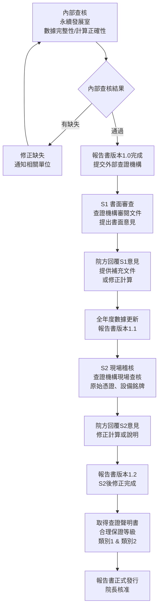

# 溫室氣體查證作業程序書

## 1. 目的與範圍

### 1.1 目的

本程序書旨在規範國軍高雄總醫院年度溫室氣體盤查報告書之查證作業，包含內部查核程序與外部第三方查證程序，確保溫室氣體排放數據之正確性、一致性與可信度，並符合 ISO 14064-3:2019 查證規範要求。

### 1.2 適用範圍

適用於國軍高雄總醫院溫室氣體盤查報告書年度查證作業，涵蓋：

- **內部查核**：由永續發展室執行，於報告書提交外部查證前完成
- **外部查證**：委由第三方公正單位（查證機構）執行，針對類別1與類別2排放源
- **查證類別**：依規劃階段類別1與類別2以**合理保證等級**進行
- **適用標準**：ISO 14064-1:2018、ISO 14064-3:2019

### 1.3 查證機構

本院委由**立恩威國際驗證股份有限公司**（SGS子公司）擔任外部查證機構，具備環境管理體系及溫室氣體查證資格。

---

## 2. 相關文件

| 文件類型 | 文件編號 | 文件名稱 |
|---------|---------|---------|
| 程序書 | PRO-GHG-INV | 溫室氣體盤查作業程序書 |
| 報告書 | RPT-GHG-2025 | 2025年溫室氣體盤查報告書 |
| 指引 | GDL-CALC-METHOD | 溫室氣體排放量計算方法指引 |
| 清冊 | MTX-EMISSION | 溫室氣體排放源清冊 |

---

## 3. 角色與責任（RACI）

| 作業項目 | 院長 | 永續發展室 | 各業務單位 | 外部查證機構 |
|---------|------|---------|---------|------------|
| 內部查核執行 | I | **R/A** | C | - |
| 外部查證委辦 | A | **R** | I | - |
| 查證文件準備 | I | **R** | C | I |
| S1書面審查配合 | I | **R** | C | **R** |
| S2現場稽核配合 | I | **R** | C | **R** |
| 查證意見回覆 | I | **R** | C | **A** |
| 報告書修正 | I | **R** | C | I |
| 查證聲明書接收 | A | **R** | I | **R** |

---

## 4. 程序步驟

### 4.1 查證作業流程圖

### 4.2 內部查核程序

內部查核由永續發展室於每年1月初執行，針對各業務單位提交之活動數據進行審查。

#### 4.2.1 查核項目清單

| 查核類別 | 查核項目 | 查核方法 |
|---------|---------|---------|
| 數據蒐集 | 所有排放源均有對應活動數據 | 對照MTX-EMISSION清冊逐項確認 |
| 數據蒐集 | 各業務單位月報表無遺漏 | 確認12個月資料完整 |
| 計算正確性 | 排放係數版本為最新公告版 | 對照環境部最新公告 |
| 計算正確性 | GWP值引用IPCC AR6版本 | 對照GDL-CALC-METHOD |
| 計算正確性 | 單位換算正確 | 抽查至少5個排放源 |
| 數據合理性 | 與上年度同期比較 | 差異超過20%須書面說明原因 |
| 數據合理性 | 冷媒填充量與設備銘牌一致 | 工程室提供設備資料佐證 |
| 邊界確認 | 租用單位排除量正確 | 工程室確認抄表紀錄 |
| 邊界確認 | 721營站排除量正確 | 工程室確認電費單 |

#### 4.2.2 不符合事項處理

發現不符合事項時：

1. 記錄不符合事項（類型、排放源、影響範圍）
2. 通知相關業務單位，要求提供補充說明或重新填報
3. 重新計算受影響排放量
4. 確認修正後重新執行查核

### 4.3 外部查證程序

#### 4.3.1 查證保證等級

| 類別 | 規劃保證等級 | 說明 |
|------|-----------|------|
| 類別1 直接排放 | 合理保證 | 依查證過程中各項佐證判定 |
| 類別2 外購電力 | 合理保證 | 依查證過程中各項佐證判定 |

**合理保證等級**定義：查證機構已收集充分且適切之查證證據，以對溫室氣體報告書做出合理查證結論，提供高但非絕對的保證。

#### 4.3.2 第一階段（S1）書面審查

**時程**（以2025年盤查為例）：2026年1月14日

**查證機構審查文件清單：**

| 文件類型 | 文件名稱 |
|---------|---------|
| 盤查報告書 | 溫室氣體盤查報告書（版本1.0） |
| 計算方法 | GDL-CALC-METHOD |
| 排放源清冊 | MTX-EMISSION |
| 活動數據 | 各業務單位月報表（FRM-DATA-*） |
| 係數依據 | 環境部排放係數公告文件 |
| 組織文件 | 盤查推動組織架構圖、職責分工 |

**院方配合事項：**

1. 提前完成報告書版本1.0
2. 準備各類原始憑證電子掃描檔
3. S1期間提供書面意見回覆（5個工作日內）
4. 更新全年度數據，完成版本1.1

#### 4.3.3 第二階段（S2）現場稽核

**時程**（以2025年盤查為例）：2026年2月2日

**現場稽核內容：**

| 稽核項目 | 院方配合人員 |
|---------|-----------|
| 組織邊界實地確認 | 永續發展室、工程室 |
| 電表抄表紀錄核對 | 工程室 |
| 冷媒設備銘牌確認 | 工程室 |
| 燃料採購發票核對 | 醫勤組、駕駛班 |
| 麻醉藥品請領紀錄核對 | 衛保室 |
| 氣體鋼瓶採購紀錄核對 | 職安室 |
| 計算電子檔審閱 | 永續發展室 |

**S2後作業：**

1. 針對查證機構提出之意見，進行必要修正
2. 完成報告書版本1.2（S2後修正版）
3. 取得查證聲明書

#### 4.3.4 查證聲明書

取得查證聲明書後確認以下項目：

- 查證範圍涵蓋本院類別1與類別2排放源
- 查證保證等級符合規劃（合理保證）
- 查證期間與本次盤查年份一致
- 無重大不符合事項
- 查證機構簽章完整

---

## 5. 監控與量測（SLA）

### 5.1 查證時程SLA

| 里程碑 | 時程要求 | 負責單位 |
|------|---------|---------|
| 內部查核完成 | 每年1月10日前 | 永續發展室 |
| 報告書版本1.0送查 | 每年1月15日前 | 永續發展室 |
| S1書面審查完成 | 每年1月中旬 | 查證機構 |
| S1意見回覆 | S1結束後5個工作日 | 永續發展室 |
| 版本1.1完成 | 每年1月底前 | 永續發展室 |
| S2現場稽核完成 | 每年2月初 | 查證機構 |
| S2意見回覆 | S2結束後5個工作日 | 永續發展室 |
| 版本1.2完成 | 每年3月底前 | 永續發展室 |
| 查證聲明書取得 | 每年3月底前 | 查證機構 |

### 5.2 查證品質指標

| 指標 | 目標值 |
|------|------|
| 重大不符合事項 | 0件 |
| 輕微不符合事項 | ≤ 3件 |
| 查證保證等級達標 | 類別1&2合理保證 |
| 報告書按時發行 | 每年3月底前 |

---

## 6. 紀錄與保存

| 紀錄類型 | 保存格式 | 保存期限 | 保管單位 |
|---------|---------|---------|---------|
| 內部查核紀錄 | 電子檔 | 6年 | 永續發展室 |
| 不符合事項處理紀錄 | 電子檔 | 6年 | 永續發展室 |
| 查證機構往來函文 | 電子郵件/紙本 | 6年 | 永續發展室 |
| S1書面審查意見與回覆 | 電子檔 | 6年 | 永續發展室 |
| S2稽核意見與回覆 | 電子檔 | 6年 | 永續發展室 |
| 查證聲明書正本 | 紙本及PDF | 6年 | 永續發展室 |
| 各版本報告書 | PDF | 6年 | 永續發展室 |

---

## 7. 附錄

### 附錄A：查證機構資訊

| 項目 | 說明 |
|------|------|
| 機構名稱 | 立恩威國際驗證股份有限公司 |
| 母公司 | SGS（瑞士通用公正行） |
| 查證資格 | ISO 14064溫室氣體查證 |
| 聯繫方式 | 依年度合約為準 |

### 附錄B：查證術語對照

| 中文術語 | 英文術語 | 說明 |
|---------|---------|------|
| 合理保證 | Reasonable Assurance | 高但非絕對的保證等級 |
| 有限保證 | Limited Assurance | 較低程度的保證等級 |
| 書面審查（S1） | Stage 1 - Document Review | 查證第一階段，以文件審查為主 |
| 現場稽核（S2） | Stage 2 - On-Site Audit | 查證第二階段，現場查核原始憑證 |
| 查證聲明書 | Verification Statement | 查證機構出具之正式查證結論文件 |
| 重大不符合 | Major Non-conformity | 影響排放量計算正確性之缺失 |
| 輕微不符合 | Minor Non-conformity | 不影響排放量但違反程序之缺失 |

### 附錄C：歷年查證紀錄

| 盤查年度 | S1日期 | S2日期 | 查證機構 | 報告書版本 | 保證等級 |
|---------|--------|--------|---------|---------|---------|
| 2024年 | - | - | 立恩威國際驗證 | 1.2 | 合理保證 |
| 2025年 | 2026/01/14 | 2026/02/02 | 立恩威國際驗證 | 1.2 | 合理保證（類別1&2） |

### 附錄D：程序書版次歷史

| 版次 | 修訂日期 | 修訂內容 | 修訂人 |
|------|---------|---------|------|
| 1.0 | 2026-03-19 | 初版建立 | 永續發展室 |
