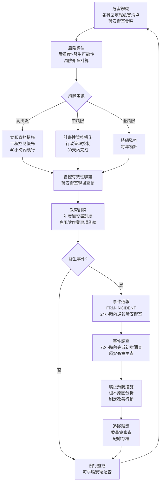

# 職業安全衛生管理程序書

**制定單位：** 環安衛室
**版本：** 1.0
**生效日期：** 2026-05-05
**上位政策：** POL-ESG 永續發展政策

---

## 1. 目的與範圍

### 1.1 目的

本程序書旨在規範國軍高雄總醫院職業安全衛生管理作業，依據《職業安全衛生法》及相關法規要求，建立系統性的危害辨識、風險評估、管控措施及事件通報與調查機制，保障全體員工於醫療工作環境中之安全與健康。

### 1.2 適用範圍

本程序適用於國軍高雄總醫院全院所有員工（含正式員工、約聘僱人員、實習生及長期駐院之廠商人員），涵蓋下列高風險作業環境：

- 針扎及銳器傷害暴露（注射、靜脈穿刺、手術）
- 跌倒滑倒事故（潮濕地面、推床、梯階）
- 化學性暴露（細胞毒性藥品、消毒劑、清潔劑）
- 放射線暴露（X光、電腦斷層、放射腫瘤治療）
- 病患及家屬暴力事件
- 感染性生物暴露（血液、體液、空氣飛沫）

### 1.3 參考法規

| 法規名稱 | 主管機關 | 說明 |
|---------|---------|------|
| 職業安全衛生法 | 勞動部 | 基本母法 |
| 職業安全衛生設施規則 | 勞動部 | 作業場所設施標準 |
| 職業安全衛生教育訓練規則 | 勞動部 | 教育訓練要求 |
| 勞工健康保護規則 | 勞動部 | 健康檢查與管理 |
| 職業災害勞工保護法 | 勞動部 | 職災補償與保護 |
| 醫療機構感染管制辦法 | 衛生福利部 | 感染暴露防護要求 |

---

## 2. 相關文件

| 文件類型 | 文件編號 | 文件名稱 |
|---------|---------|---------|
| 政策文件 | POL-ESG | 永續發展政策 |
| 表單 | FRM-INCIDENT | 職災/異常事件通報表 |
| 紀錄冊 | REG-OHS-COMMITTEE | 職業安全衛生委員會會議紀錄 |

---

## 3. 角色與責任（RACI）

### 3.1 RACI 矩陣

| 作業項目 | 環安衛室 | 各科室主管 | 職安衛委員會 | 全體員工 | 院長 |
|---------|---------|-----------|------------|---------|------|
| 危害辨識與風險評估 | R/A | R | C | I | I |
| 管控措施制定 | R/A | C | C | I | I |
| 教育訓練執行 | R/A | R | C | I | I |
| 事件通報（初報）| I | I | I | **R** | I |
| 事件調查 | **R/A** | C | C | I | I |
| 矯正預防措施執行 | A | **R** | C | I | I |
| 委員會召開 | R | I | **A** | I | A |
| 年度職安衛計畫核准 | R | I | C | I | **A** |

**RACI 說明：**
- **R** = Responsible（執行負責）
- **A** = Accountable（當責核准）
- **C** = Consulted（諮詢提供意見）
- **I** = Informed（知會告知）

### 3.2 各單位職責說明

**環安衛室（主責單位）**
- 統籌規劃年度職安衛工作計畫
- 執行職場危害辨識與風險評估
- 擔任職安衛委員會秘書，負責會議召集與紀錄
- 受理並調查職災及異常事件
- 辦理職安衛教育訓練
- 向主管機關申報職業災害

**各科室主管**
- 執行科室內之危害管控措施
- 督導所屬員工遵守職安衛規定
- 確保科室內設備設施安全
- 接獲事件通報後立即採取緊急處置

**職業安全衛生委員會**
- 審議年度職安衛計畫
- 審核危害辨識及風險評估結果
- 審議重大事件改善措施
- 督導職安衛工作執行成效

**全體員工**
- 遵守職安衛規定及作業標準
- 發現危害或異常事件立即通報
- 參加職安衛教育訓練

---

## 4. 程序步驟

本章節說明職災事件通報流程、危害辨識流程、風險評估流程及矯正措施流程。員工遭遇職災或異常事件時，應依據本通報流程於規定時限內完成通報。

### 4.1 作業流程圖

### 4.2 步驟說明

#### 步驟1：危害辨識

每年1月由環安衛室發起全院危害辨識：

1. 發送危害辨識問卷至各科室
2. 彙整各科室提報之危害項目
3. 依醫院特有危害類型分類：
   - **生物性危害**：血液/體液暴露、感染性廢棄物、針扎
   - **化學性危害**：細胞毒性藥品（化療藥）、消毒劑、清潔劑、麻醉廢氣
   - **物理性危害**：放射線、噪音、溫熱環境
   - **人因性危害**：搬運病患、長時間站立、夜班作業
   - **社會心理性危害**：病患/家屬暴力、工作壓力

#### 步驟2：風險評估

依風險矩陣評估各危害項目：

| 嚴重度\發生可能性 | 極少發生(1) | 偶爾發生(2) | 經常發生(3) | 頻繁發生(4) |
|-----------------|-----------|-----------|-----------|-----------|
| 輕微傷害(1) | 1-低 | 2-低 | 3-中 | 4-中 |
| 中度傷害(2) | 2-低 | 4-中 | 6-中 | 8-高 |
| 重大傷害(3) | 3-中 | 6-中 | 9-高 | 12-高 |
| 死亡/永久失能(4) | 4-中 | 8-高 | 12-高 | 16-極高 |

**風險等級處置原則：**
- 極高（≥12）：立即停工，採取緊急管控措施
- 高（8-11）：48小時內完成管控措施
- 中（3-7）：30天內完成改善計畫
- 低（1-2）：每年複評，維持現行管控

#### 步驟3：管控措施

依「消除→替代→工程控制→行政管控→個人防護裝備」之優先順序選擇管控措施：

| 醫院主要危害 | 優先管控措施 | 輔助措施 |
|------------|------------|---------|
| 針扎傷害 | 安全型針具（工程控制）| 標準防護措施、教育訓練 |
| 跌倒 | 防滑地面、扶手設施 | 濕地標示、防滑鞋政策 |
| 化學暴露（化療藥）| 密閉調配系統、生物安全櫃 | 個人防護裝備（手套、面罩）|
| 放射線暴露 | 防護屏蔽、距離管制 | 個人劑量計、輻射防護訓練 |
| 暴力事件 | 保全人員配置、監視系統 | 去激化溝通訓練 |
| 感染暴露 | 隔離措施、通風系統 | N95口罩、個人防護裝備 |

#### 步驟4：事件通報

員工遭遇職災或異常事件時，依以下流程通報：

1. 立即採取自救與急救措施
2. 通知科室主管
3. 24小時內填寫 FRM-INCIDENT 提交環安衛室
4. 環安衛室評估是否需向勞工局申報

**應立即通報之事件（1小時內）：**
- 針扎或血液/體液暴露
- 化療藥品外洩接觸
- 重大跌倒傷害（需送急診）
- 暴力傷害

#### 步驟5：事件調查

環安衛室於72小時內完成初步調查：

1. 保存現場證據（照片、相關紀錄）
2. 訪談當事人及目擊者
3. 分析直接原因及根本原因（魚骨圖或5Why分析）
4. 評估事件嚴重度及同類事件潛在風險

#### 步驟6：矯正預防措施

依調查結果制定改善行動：

1. 短期：消除立即危害
2. 中期：改善管理制度或作業程序
3. 長期：設施設備改善或政策修訂
4. 提報職安衛委員會審查

---

## 5. 監控與量測（SLA）

### 5.1 時效要求

| 作業項目 | 時效要求 | 責任人 |
|---------|---------|------|
| 事件初始通報（員工至環安衛室）| 24小時內 | 全體員工/科室主管 |
| 事件初步調查完成 | 72小時內 | 環安衛室 |
| 勞工局職災申報（重大職災）| 8小時內（電話）/ 24小時內（書面）| 環安衛室 |
| 矯正預防措施制定 | 事件後7日內 | 環安衛室 |
| 高風險管控措施落實 | 識別後48小時內 | 環安衛室/科室主管 |
| 年度危害辨識更新 | 每年1月完成 | 環安衛室 |
| 職安衛委員會召開 | 每季至少一次 | 環安衛室（秘書）|

### 5.2 年度績效指標

| 指標 | 目標值 | 評量頻率 |
|------|------|---------|
| 職業災害發生率（每百萬工時）| ≤ 前年度 | 每年 |
| 針扎事件通報率 | ≥ 95% | 每季 |
| 職安衛教育訓練完訓率 | ≥ 95% | 每年 |
| 重大危害改善完成率 | 100% | 每季 |
| 委員會決議追蹤完成率 | ≥ 90% | 每季 |

---

## 6. 紀錄與保存

### 6.1 保存清單

| 紀錄類型 | 保存格式 | 保存期限 | 保管單位 |
|---------|---------|---------|---------|
| 危害辨識及風險評估表 | 電子檔 | 5年 | 環安衛室 |
| 事件通報表（FRM-INCIDENT）| 電子檔+紙本 | 5年 | 環安衛室 |
| 事件調查報告 | 電子檔 | 5年 | 環安衛室 |
| 職安衛委員會會議紀錄 | 電子檔+紙本 | 5年 | 環安衛室 |
| 教育訓練出席紀錄 | 電子檔 | 5年 | 環安衛室/人事室 |
| 勞工局申報文件 | 紙本及電子掃描 | 5年 | 環安衛室 |

---

## 7. 附錄

### 附錄A：醫院主要危害及現行管控措施清單

| 危害類型 | 相關作業 | 現行管控措施 | 風險等級 |
|---------|---------|------------|---------|
| 針扎 | 注射、靜脈穿刺、手術 | 安全型針具、標準防護 | （待評估）|
| 跌倒 | 走廊、廁所、推床 | 防滑設施、濕地標示 | （待評估）|
| 化療藥品暴露 | 化療調配、給藥 | 生物安全櫃、防護裝備 | （待評估）|
| 放射線暴露 | X光、CT、治療 | 屏蔽防護、個人劑量計 | （待評估）|
| 暴力傷害 | 急診、精神科 | 保全配置、監視系統 | （待評估）|
| 感染暴露 | 感染病房、手術 | 隔離措施、個人防護裝備 | （待評估）|

### 附錄B：相關表單清單

| 表單編號 | 表單名稱 | 使用單位 |
|---------|---------|---------|
| FRM-INCIDENT | 職災/異常事件通報表 | 全體員工 |

### 附錄C：程序書版次歷史

| 版次 | 修訂日期 | 修訂內容 | 修訂人 |
|------|---------|---------|------|
| 1.0 | 2026-05-05 | 初版建立 | 環安衛室 |
