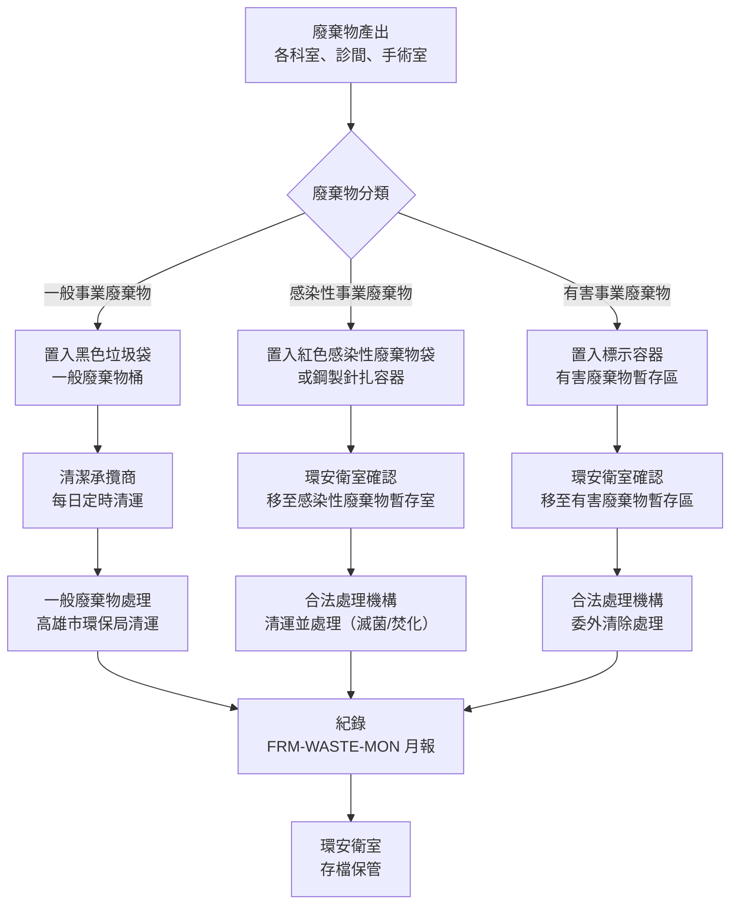

# 醫療廢棄物管理程序書

**制定單位：** 環安衛室
**版本：** 1.0
**生效日期：** 2026-05-05

---

## 1. 目的與範圍

### 1.1 目的

本程序書旨在規範國軍高雄總醫院廢棄物之分類、收集、暫存、清運及最終處理作業，確保符合廢棄物清理相關法規要求，保障院內人員健康與安全，並降低廢棄物對環境之衝擊。

### 1.2 適用範圍

適用於本院院區（高雄市苓雅區中正一路2號）產生之所有事業廢棄物，依性質分為：

- **一般事業廢棄物**：辦公紙張、包裝材料、廚餘（非傳染性）、一般生活垃圾
- **感染性事業廢棄物**：廢針頭、廢注射器、手術廢棄物、病理廢棄物、帶有體液或血液污染物
- **有害事業廢棄物**：廢藥品、廢化學品、廢顯影液、含汞廢棄物、廢電池

### 1.3 參考標準

- 廢棄物清理法（民國112年修正）
- 事業廢棄物貯存清除處理方法及設施標準（環境部）
- 感染性事業廢棄物清除處理及標示方法（環境部）
- 醫療廢棄物容器標誌標準（CNS相關規範）

---

## 2. 相關文件

| 文件類型 | 文件編號 | 文件名稱 |
|---------|---------|---------|
| 政策文件 | POL-ESG | 永續發展政策 |
| 法規摘要 | STD-WASTE-REG | 廢棄物管理法規摘要 |
| 表單 | FRM-WASTE-MON | 廢棄物處理月報表 |

---

## 3. 角色與責任（RACI）

### 3.1 RACI 矩陣

| 作業項目 | 環安衛室 | 各科室 | 清潔承攬商 | 合法處理機構 | 院長 |
|---------|---------|------|---------|------------|------|
| 廢棄物分類宣導與訓練 | **R** | C | I | I | A |
| 廢棄物於產出點分類 | C | **R** | I | I | I |
| 一般廢棄物收集清運 | I | I | **R** | I | I |
| 感染性廢棄物收集暫存 | **R** | R | C | I | I |
| 感染性廢棄物清運處理 | R | I | I | **R** | A |
| 有害廢棄物收集暫存 | **R** | R | I | I | I |
| 有害廢棄物委外處理 | **R** | I | I | R | A |
| 廢棄物聯單管理 | **R** | I | C | C | I |
| 月報表填報審核 | **R** | I | I | I | I |
| 合規稽核 | **R** | C | C | I | A |

**RACI說明：**
- **R** = Responsible（執行負責）
- **A** = Accountable（當責核准）
- **C** = Consulted（諮詢提供意見）
- **I** = Informed（知會告知）

### 3.2 各單位職責說明

**環安衛室**
- 統籌廢棄物管理制度制定與執行督導
- 維護廢棄物暫存場所，確保符合法規要求
- 管理廢棄物清運聯單及紀錄保存
- 每月填報 FRM-WASTE-MON 廢棄物處理月報表
- 執行年度廢棄物管理合規稽核

**各科室**
- 依本程序書規定在廢棄物產出點執行正確分類
- 使用規定容器（顏色/標誌）盛裝廢棄物
- 配合環安衛室進行廢棄物管理教育訓練

**清潔承攬商**
- 依合約規定時間執行一般廢棄物日常清運
- 依環安衛室指引配合感染性廢棄物搬運作業
- 不得擅自混合不同類別廢棄物

**合法處理機構**
- 持合法許可證執行感染性及有害廢棄物清運與最終處理
- 提供三聯式廢棄物清除處理聯單
- 定期提供處理結果紀錄

---

## 4. 程序步驟

### 4.1 作業流程圖

### 4.2 步驟說明

#### 步驟1：廢棄物分類（各科室）

各科室人員依以下顏色編碼及容器規定分類廢棄物：

| 廢棄物類別 | 容器顏色/標誌 | 常見項目 |
|---------|------------|---------|
| 一般事業廢棄物 | 黑色垃圾袋 | 紙張、包裝材料、未受汙染一次性物品 |
| 感染性事業廢棄物 | 紅色廢棄物袋（印有感染性廢棄物標誌）| 手術廢棄物、血液污染物、廢棄敷料 |
| 感染性針扎廢棄物 | 黃色鋼製（防刺穿）容器 | 針頭、注射器針筒、手術刀片、靜脈留置針 |
| 有害廢棄物（廢藥品）| 藍色回收容器（藥品回收專用）| 過期藥品、未使用藥品 |
| 有害廢棄物（廢化學品）| 標示原廠容器或防漏容器 | 廢顯影液、廢化學試劑 |

#### 步驟2：暫存作業（環安衛室）

| 廢棄物類別 | 暫存地點 | 最長暫存期限 | 容量管理 |
|---------|---------|------------|---------|
| 感染性廢棄物 | 感染性廢棄物暫存室（隔離、上鎖）| 30日 | 達80%容量即安排清運 |
| 有害廢棄物 | 有害廢棄物暫存區（通風、防漏）| 30日 | 逐件登記，達一定量即清運 |
| 一般廢棄物 | 垃圾暫存區 | 1日（次日清運）| — |

暫存場所每週由環安衛室巡查一次，確認無滲漏、標示清楚、容量未超限。

#### 步驟3：清運委託（環安衛室）

感染性及有害廢棄物清運須委託持有合法許可證之廢棄物清除處理機構，程序如下：

1. 環安衛室核對承攬商合法許可證有效期限（每年確認一次）
2. 依暫存量及頻率安排清運日期
3. 清運前由環安衛室確認廢棄物重量並填寫三聯式聯單
4. 清運人員簽收，環安衛室保留聯單第一聯
5. 處理完成後收回第三聯（處理結果聯）

#### 步驟4：紀錄填報（環安衛室）

每月清運結束後，環安衛室填報 FRM-WASTE-MON 廢棄物處理月報表，記錄各類廢棄物：

- 廢棄物類別
- 重量（公斤）
- 清運機構名稱
- 聯單編號
- 處理方式

---

## 5. 監控與量測（SLA）

| 服務項目 | 標準 | 責任單位 |
|---------|------|---------|
| 一般廢棄物清運頻率 | 每日（工作日）清運一次 | 清潔承攬商 |
| 感染性廢棄物暫存上限 | 不超過30日 | 環安衛室 |
| 有害廢棄物暫存上限 | 不超過30日 | 環安衛室 |
| 月報表提交期限 | 次月10日前提交 | 環安衛室 |
| 暫存場所巡查頻率 | 每週至少一次 | 環安衛室 |
| 承攬商許可證查核 | 每年至少一次 | 環安衛室 |
| 廢棄物分類教育訓練 | 每年至少一次（全體員工）| 環安衛室 |

---

## 6. 紀錄保存

| 紀錄類型 | 保存格式 | 保存期限 | 保管單位 |
|---------|---------|---------|---------|
| FRM-WASTE-MON 月報表 | 電子檔 + 紙本 | 5年 | 環安衛室 |
| 廢棄物清除處理聯單（三聯式）| 紙本原件 | 5年 | 環安衛室 |
| 承攬商合法許可證影本 | 電子檔 | 效期後3年 | 環安衛室 |
| 暫存場所巡查紀錄 | 紙本 | 3年 | 環安衛室 |
| 員工教育訓練紀錄 | 電子檔 | 3年 | 環安衛室 |

---

## 7. 附錄

### 附錄A：廢棄物分類快速參考表

| 廢棄物項目 | 正確分類 | 容器 |
|---------|---------|------|
| 辦公紙張 | 一般（可資源回收）| 資源回收桶（紙類）|
| 使用過的手術手套 | 感染性 | 紅色廢棄物袋 |
| 廢針頭 | 感染性（針扎）| 黃色防刺穿容器 |
| 過期藥品 | 有害（廢藥品）| 藥品回收容器 |
| 廢顯影液 | 有害（廢液）| 原廠防漏容器 |
| 廢電池 | 有害 | 廢電池回收桶 |
| 廚餘 | 一般 | 廚餘桶（交高雄市環保局）|
| 點滴空袋（無血液污染）| 一般 | 黑色垃圾袋 |
| 廢棄血袋 | 感染性 | 紅色廢棄物袋 |

### 附錄B：程序書版次歷史

| 版次 | 修訂日期 | 修訂內容 | 修訂人 |
|------|---------|---------|------|
| 1.0 | 2026-05-05 | 初版建立 | 環安衛室 |
