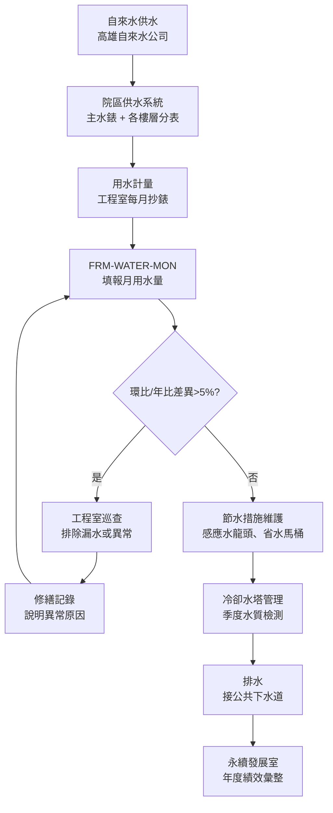

# 水資源管理程序書

**制定單位：** 工程室
**版本：** 1.0
**生效日期：** 2026-05-05

---

## 1. 目的與範圍

### 1.1 目的

本程序書旨在規範國軍高雄總醫院用水計量、節水措施推動及排水管理，建立系統性水資源監測機制，追蹤用水績效，支持 POL-ESG 永續發展政策中水資源管理目標之達成。

### 1.2 適用範圍

適用於本院院區（高雄市苓雅區中正一路2號）之所有用水活動，包含：

- 醫療用水（手術室、診間清潔）
- 生活用水（廚房、廁所、盥洗）
- 空調系統用水（冷卻水塔）
- 庭園及清潔用水

**排水說明：** 本院污水已接通高雄市公共下水道系統，無獨立化糞池或污水處理設施。排放符合下水道法規要求，無需額外申報污水處理量。

### 1.3 參考標準

- 自來水法（經濟部水利署）
- 下水道法（內政部）
- 建築物節約用水設計標準（內政部）
- EEWH 綠建築評估手冊—節水指標

---

## 2. 相關文件

| 文件類型 | 文件編號 | 文件名稱 |
|---------|---------|---------|
| 政策文件 | POL-ESG | 永續發展政策 |
| 表單 | FRM-WATER-MON | 用水量監測月報表 |

---

## 3. 角色與責任（RACI）

### 3.1 RACI 矩陣

| 作業項目 | 工程室 | 各樓層/科室 | 永續發展室 | 院長 |
|---------|------|----------|---------|------|
| 水表定期讀表 | **R** | I | I | I |
| 用水量月報填報 | **R** | I | I | I |
| 漏水巡查與修繕 | **R** | R（通報）| I | A |
| 節水設備維護 | **R** | I | I | I |
| 節水宣導 | R | **R**（配合）| C | I |
| 年度用水績效評估 | R | I | **R** | A |
| 冷卻水塔水質管理 | **R** | I | I | I |

**RACI說明：**
- **R** = Responsible（執行負責）
- **A** = Accountable（當責核准）
- **C** = Consulted（諮詢提供意見）
- **I** = Informed（知會告知）

### 3.2 各單位職責說明

**工程室**
- 每月讀取自來水水表，填報 FRM-WATER-MON
- 定期巡查院區管線，發現漏水於48小時內完成修繕或暫時封閉
- 維護節水設備（感應式水龍頭、省水馬桶、冷卻水塔）
- 管理冷卻水塔補水量及水質（防止軍團菌）

**各樓層/科室**
- 發現漏水或水設備異常立即通報工程室
- 配合節水宣導，落實日常節水行為

**永續發展室**
- 彙整年度用水量數據，納入 ESG 報告
- 追蹤節水績效目標達成狀況

---

## 4. 程序步驟

### 4.1 作業流程圖

### 4.2 步驟說明

#### 步驟1：月度用水計量

每月月底由工程室讀取自來水水表讀數：

1. 記錄本月水表讀數（m³）
2. 計算本月用水量：本月用水量 = 本月讀數 - 上月讀數
3. 與上月及去年同月比較，差異超過5%須進入步驟2巡查
4. 填報 FRM-WATER-MON

#### 步驟2：漏水巡查（每季執行，差異超標時立即執行）

漏水巡查範圍：

| 巡查區域 | 巡查項目 | 頻率 |
|---------|---------|------|
| 各樓層機電室 | 管線接頭、閥門是否滲漏 | 每季 |
| 屋頂水塔 | 水塔本體、接管、浮球閥 | 每季 |
| 地下室 | 供排水管線是否滲漏 | 每季 |
| 各樓層廁所 | 馬桶水箱不停水、水龍頭滴水 | 每月（配合月報）|
| 冷卻水塔 | 補水量異常、飄水損失 | 每季 |

#### 步驟3：節水設備維護

| 設備類型 | 維護項目 | 維護頻率 |
|---------|---------|---------|
| 感應式水龍頭 | 感測器清潔、電池更換、流量調整 | 每年 |
| 省水馬桶/小便斗 | 自動沖水設定、感測器校正 | 每年 |
| 冷卻水塔 | 水質檢測（軍團菌）、補水控制器校正 | 每季 |
| 冰水主機冷卻水系統 | 水質處理藥劑補充、管路沖洗 | 依廠商建議 |

#### 步驟4：排水管理

本院污水排入高雄市公共下水道，排放管理要求：

- 醫療廢水（含感染性物質）須經消毒滅菌後排放
- 不得排放有害化學物質（廢藥品、廢試劑應委外處理，不得沖入下水道）
- 廚房廢水須經油脂截流器後排放

---

## 5. 監控與量測（SLA）

| 監控項目 | 標準 | 頻率 | 負責單位 |
|---------|------|------|---------|
| 水表讀數 | 每月1次（月底）| 每月 | 工程室 |
| FRM-WATER-MON 填報 | 次月15日前提交 | 每月 | 工程室 |
| 漏水巡查 | 差異>5%立即執行；常規每季 | 每季 | 工程室 |
| 冷卻水塔水質檢測 | 軍團菌：陰性 | 每季 | 工程室 |
| 管線修繕時效 | 發現後48小時內修繕或暫時封閉 | 即時 | 工程室 |

---

## 6. 紀錄保存

| 紀錄類型 | 保存格式 | 保存期限 | 保管單位 |
|---------|---------|---------|---------|
| FRM-WATER-MON 月報表 | 電子檔 | 5年 | 工程室 |
| 自來水帳單 | 紙本及電子掃描 | 5年 | 工程室 |
| 漏水巡查紀錄 | 紙本 | 3年 | 工程室 |
| 修繕工作單 | 紙本及電子檔 | 5年 | 工程室 |
| 冷卻水塔水質檢測報告 | 電子檔 | 5年 | 工程室 |

---

## 7. 附錄

### 附錄A：節水績效目標

| 指標 | 基準值 | 目標 | 追蹤方式 |
|------|------|------|---------|
| 年度用水量（m³）| 待建立（首年為基準年）| 逐年維持或降低 | FRM-WATER-MON 彙整 |
| 每床日用水量（m³/床日）| 待計算 | 參考醫院節水標準 | 年度評估 |

### 附錄B：緊急漏水處理聯絡

| 狀況 | 聯絡方式 |
|------|---------|
| 院區管線大量漏水 | 工程室值班人員（24小時）|
| 自來水停水 | 高雄自來水公司 (07)731-1111 |

### 附錄C：程序書版次歷史

| 版次 | 修訂日期 | 修訂內容 | 修訂人 |
|------|---------|---------|------|
| 1.0 | 2026-05-05 | 初版建立 | 工程室 |
